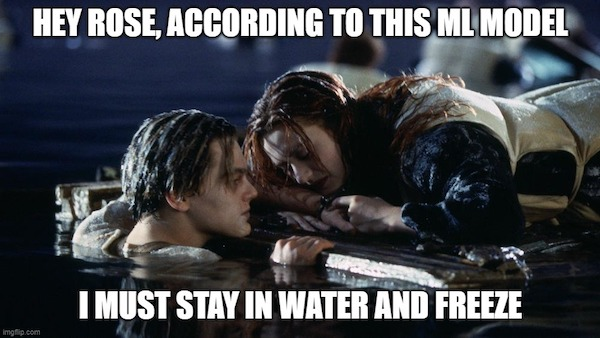

# Rose-or-Jack

## Group Members:

- Taylor Bohl
- Harish Korrapati
- Corey Lawson-Enos
- Rhiana Schafer
- Ishanjit Sidhu

## Description:
Are you a Rose or a Jack? We built a machine learning model that predicts whether you will survive a voyage on the Titanic based on your age, passenger class, passenger fare, point of embarkation, and whether you travel solo or with family.

## Dataset(s):
https://www.kaggle.com/competitions/titanic/data  

### Features and definitions included in our model:    
Survived: Binary value, 0 or 1, where 0 is not survived and 1 is survived  
Pclass: The ticket class of each passenger, either 1, 2, or 3  
Name: The name of each passenger  
Sex: Male or female  
Age: The age in years of each passenger	  
SibSp:  The number of siblings/spouses each passenger had (range 0-8)  
Parch:  The number of parents/children each passenger had (range 0-6)  
Ticket:  The ticket number of the passenger	  
Fare: The amount paid by each passenger   
Embarked: Which station each passenger boarded the ship, either C  (Cork) or S (Southampton)  

