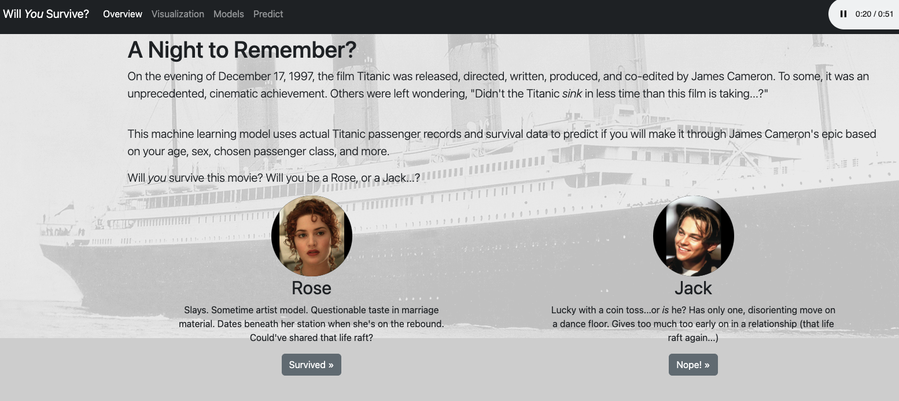
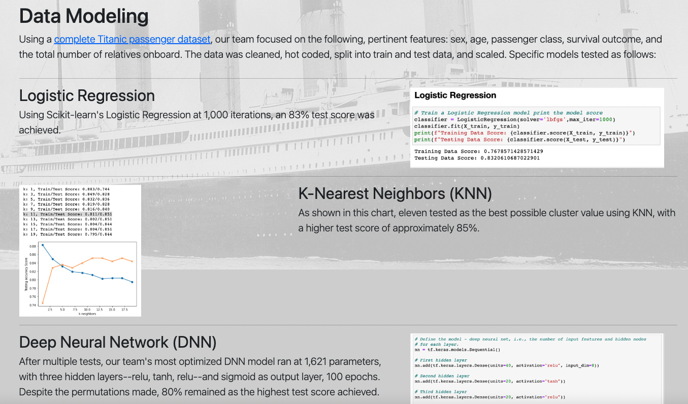
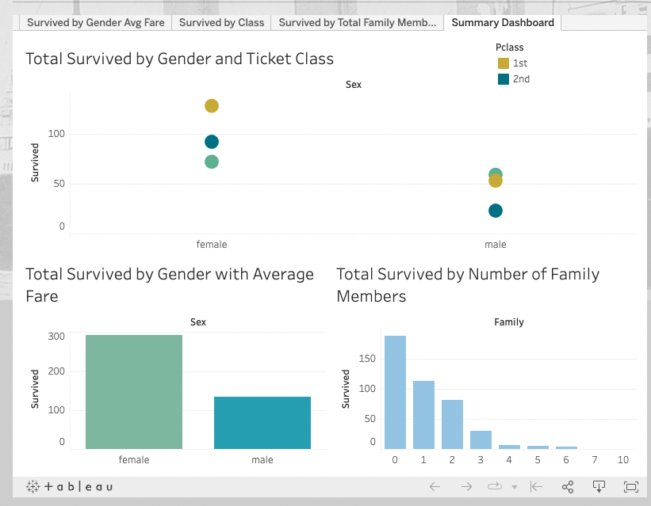
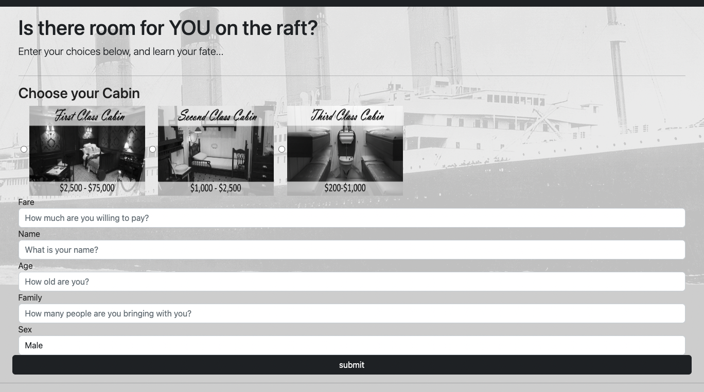

# Rose-or-Jack

## Group Members:

- Taylor Bohl
- Harish Korrapati
- Corey Lawson-Enos
- Rhiana Schafer
- Ishanjit Sidhu

## Description:
Are you a Rose or a Jack? We built a machine learning model that predicts whether you will survive a voyage on the Titanic based on your age, gender, passenger class, passenger fare, and whether you travel solo or with family.

Click [here](https://docs.google.com/presentation/d/1z2Q9StgMgdefjef6XozYUFYlIhRB27HJDzaFuvsU3iw/edit#slide=id.p) to view the presentation, it is also in PDF format above.  

## Dataset(s):
https://www.kaggle.com/competitions/titanic/data  
https://www.kaggle.com/datasets/vinicius150987/titanic3?resource=download

### Features and definitions included in our model:    
* Survived: Binary value, 0 or 1, where 0 is not survived and 1 is survived  
* Pclass: The ticket class of each passenger, either 1, 2, or 3  
* Sex: Male or female  
* Age: The age in years of each passenger	  
* Family: Combined SibSp (The number of siblings/spouses each passenger had (range 0-8) )and Parch (The number of parents/children each passenger had (range 0-6)) * columns for total travel companions.  
* Fare: The amount paid by each passenger  

## Methods:

After loading our data with Pandas, we removed unecessary columns, combined features that were similar and dropped any null values (Rose_Jack.ipynb). The cleaned data was saved as a csv (titanic_cleaned.csv). We then prepared the data for modeling by one hot coding the gender and ticket class features and scaling using SKLearn's standard scaler.  

We trained several models on our data (Rose_Jack.ipynb) and tried some feature engineering (feature_engineering.ipynb), and the highest accuracy resulted from the Random Forest Classifier Model. You can see further details of the models we tried below and via the application.  

Once we obtained our model, we exported it along with the scaler for use in the predictor form on our application. We deployed our app using Heroku, which renders each HTML template and powers the form as well.  

For some research prior to making your selections on the form, we also included some visualizations with Matplotlib on the Models page and a Tableau dashboard on the Visuals page.

## Application and Form:

Click [here](https://roseorjack.herokuapp.com/) to access the application.

After clicking the link above, you'll land on our home page as shown below. You can navigate through the pages via the links in the header or using the buttons next to each summary. You can also access the predictor form via the buttons below Rose and Jack's bios.  

A screenshot of the models page is below, we trained Logisitc Regression, KNN and Deep Neural Network models on our data in addition to the Random Forest Classifier Model which yielded ~.85 accuracy.

You can also scroll through several plots created in Tableau on the Visualizations page, which display trends in survival based on gender, ticket class, fare and travel companions.

Finally, on the Predictor page, you can enter your credentials to determine your fate on the Titanic based on the model we built. Choose carefully!

